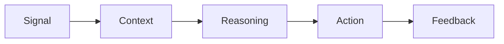

# The V.E.N.K.A.T Framework for Agentic AI

**Enterprise Architecture for AI systems that can observe, understand, reason, act, and learn responsibly at scale.**

The V.E.N.K.A.T Framework is a six-layer architectural model for the Agentic AI era:

- **V — Verified Data**
- **E — Event-Driven Architecture**
- **N — Native Spatial Intelligence**
- **K — Knowledge Graphs**
- **A — AI Orchestration**
- **T — Trust & Governance**

Together, these layers enable:

> **Signal → Context → Reasoning → Action → Feedback**

## Why This Framework Matters

Traditional enterprise frameworks were largely designed for systems that inform humans through reports, dashboards, and workflows. Agentic AI changes the architecture requirement because AI systems are increasingly expected to take action.

The V.E.N.K.A.T Framework complements frameworks such as TOGAF, DAMA-DMBOK, Data Mesh, and cloud adoption frameworks by focusing specifically on the architectural foundation required for trusted AI-driven execution.

## Repository Contents

```text
docs/           Framework overview, comparisons, adoption guide
use-cases/      Logistics, manufacturing, energy grid, and digital twin examples
architecture/   Reference architecture and Mermaid diagrams
whitepaper/     PDF and long-form framework documents
presentations/  Conference and executive presentation assets
```

## Core Value Flow



## Citation

If you reference this framework, please cite:

**Kondepati, Venkata. The V.E.N.K.A.T Framework: Enterprise Architecture for Agentic AI. 2026.**
