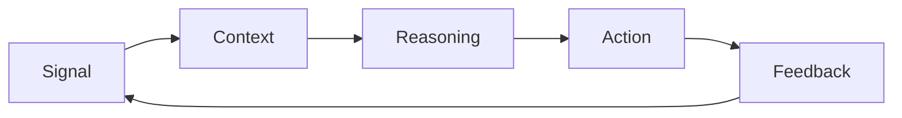

# The V.E.N.K.A.T Framework for Agentic AI

**Enterprise Architecture for the Agentic AI Era**

The V.E.N.K.A.T Framework is a reference architecture for trusted autonomous enterprise systems. It helps organizations move from AI experiments and dashboards toward governed systems that can observe signals, understand context, reason over relationships, orchestrate action, and learn from feedback.

Website: [https://venkatframework.com](https://venkatframework.com/)

Whitepaper: [https://venkatframework.com/whitepaper](https://venkatframework.com/whitepaper)

Practitioner & Certification Suite: [https://venkatframework.com/practitioner/](https://venkatframework.com/practitioner/)

Study Guide & Skills Path: [https://venkatframework.com/practitioner/study-guide.html](https://venkatframework.com/practitioner/study-guide.html)

Verified Data Guide: [https://venkatframework.com/practitioner/verified-data-guide.html](https://venkatframework.com/practitioner/verified-data-guide.html)


## Framework Overview

Agentic AI is an architecture problem before it is a model problem. Enterprise AI systems need more than prompts, models, and dashboards. They need trusted data, real-time signals, spatial context, connected knowledge, orchestrated execution, and governance controls that make autonomous action accountable.

The V.E.N.K.A.T Framework organizes those capabilities into six architectural layers:

| Letter | Layer | Purpose |
| --- | --- | --- |
| V | Verified Data | Establish trusted, governed, observable, and validated enterprise data. |
| E | Event-Driven Architecture | Capture real-time operational signals that AI systems can respond to. |
| N | Native Spatial Intelligence | Treat location, movement, proximity, routing, and geographic constraints as first-class context. |
| K | Knowledge Graphs | Connect entities, assets, policies, events, dependencies, customers, and risks. |
| A | AI Orchestration | Coordinate agents, tools, workflows, APIs, systems, and human checkpoints. |
| T | Trust & Governance | Enforce security, policy, explainability, auditability, compliance, and responsible control. |

## Value Flow

The framework enables the operating loop required for agentic enterprise systems:

> **Signal -> Context -> Reasoning -> Action -> Feedback**



## Whitepaper v1.0

Release files are available in the repository under [whitepaper/](whitepaper/):

- [VENKAT_Framework_Whitepaper_V1_Professional.pdf](whitepaper/VENKAT_Framework_Whitepaper_V1_Professional.pdf)
- [VENKAT_Framework_Whitepaper_V1_Professional.docx](whitepaper/VENKAT_Framework_Whitepaper_V1_Professional.docx)

The public landing page is available at [https://venkatframework.com/whitepaper](https://venkatframework.com/whitepaper).

## Repository Contents

```text
index.html        Static website for the framework
author.html       Author profile page
site/             Website CSS, JavaScript, and site assets
practitioner/     Adoption handbook, control catalog, templates, and certification pilot
docs/             Framework overview, comparisons, adoption guidance, and visuals
use-cases/        Applied logistics, manufacturing, energy, and digital twin scenarios
architecture/     Reference architecture and architecture stack documents
whitepaper/       Version 1.0 whitepaper PDF and DOCX files
assets/           Public release asset staging area
releases/         Release notes and release packaging notes
presentations/    Conference and executive presentation materials
```

## Key Documents

- [Framework Overview](docs/framework-overview.md)
- [TOGAF Comparison](docs/togaf-comparison.md)
- [DAMA-DMBOK Comparison](docs/dama-comparison.md)
- [Data Mesh Comparison](docs/data-mesh-comparison.md)
- [Adoption Maturity Model](docs/adoption-maturity-model.md)
- [Agentic AI Reference Architecture](architecture/agentic-ai-reference-architecture.md)
- [Logistics 50-Truck Scenario](use-cases/logistics-50-truck-scenario.md)
- [Manufacturing Digital Twin](use-cases/manufacturing-digital-twin.md)
- [Energy Grid Optimization](use-cases/energy-grid-optimization.md)

## Suggested Citation

Kondepati, V. (2026). *The V.E.N.K.A.T Framework(TM): Enterprise Architecture for the Agentic AI Era - A Reference Architecture for Trusted Autonomous Enterprise Systems, Version 1.0*. Venkat Framework Initiative. Available at [https://venkatframework.com/whitepaper](https://venkatframework.com/whitepaper)

## License and Contributions

See [LICENSE](LICENSE) and [CONTRIBUTING.md](CONTRIBUTING.md) for usage and contribution guidance.
