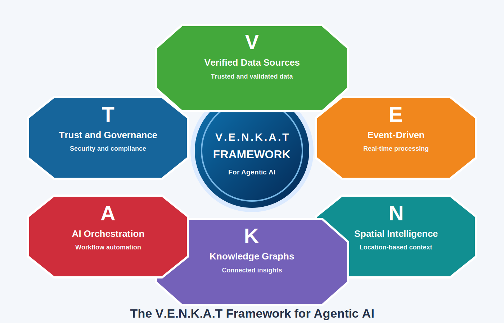
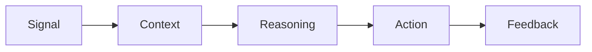

# The V.E.N.K.A.T Framework for Agentic AI

**Enterprise Architecture for AI systems that can observe, understand, reason, act, and learn responsibly at scale.**



The V.E.N.K.A.T Framework is a six-layer architectural model for the Agentic AI era:

- **V - Verified Data**
- **E - Event-Driven Architecture**
- **N - Native Spatial Intelligence**
- **K - Knowledge Graphs**
- **A - AI Orchestration**
- **T - Trust & Governance**

Together, these layers enable:

> **Signal -> Context -> Reasoning -> Action -> Feedback**

## Why This Framework Matters

Traditional enterprise frameworks were largely designed for systems that inform humans through reports, dashboards, and workflows. Agentic AI changes the architecture requirement because AI systems are increasingly expected to take action.

The V.E.N.K.A.T Framework complements frameworks such as TOGAF, DAMA-DMBOK, Data Mesh, and cloud adoption frameworks by focusing specifically on the architectural foundation required for trusted AI-driven execution.

## Repository Contents

```text
index.html      Static website for the framework
site/           Website CSS and browser-local feedback behavior
docs/           Framework overview, comparisons, adoption guide
use-cases/      Logistics, manufacturing, energy grid, and digital twin examples
architecture/   Reference architecture and Mermaid diagrams
whitepaper/     PDF and long-form framework documents
presentations/  Conference and executive presentation assets
```

## Core Value Flow



## Articles and Visuals

See [Articles and Visuals](docs/articles-and-visuals.md) for companion Medium articles and presentation-ready framework graphics.

Open [index.html](index.html) to explore the static website.

The Community section uses GitHub Issues-backed comments through [utterances](https://utteranc.es/). To enable public comments on GitHub Pages, install the utterances GitHub App for this repository and keep Issues enabled.

Featured article:

- [The V.E.N.K.A.T Framework: Building Enterprise Data Platforms for the Agentic AI Era](https://medium.com/@venkata.kondepati/the-v-e-n-k-a-t-framework-building-enterprise-data-platforms-for-the-agentic-ai-era-20352f548e40) by Venkata Kondepati, Medium.
- [The V.E.N.K.A.T Framework: Building Enterprise Architectures for the Agentic AI Era](https://medium.com/@venkata.kondepati/the-v-e-n-k-a-t-framework-building-enterprise-architectures-for-the-agentic-ai-era-d70cdf9c9b0e) by Venkata Kondepati, Medium.
- [Why Traditional Enterprise Frameworks Are Not Enough for the Agentic AI Era: Introducing the V.E.N.K.A.T Framework](https://medium.com/@venkata.kondepati/why-traditional-enterprise-frameworks-are-not-enough-for-the-agentic-ai-era-introducing-the-v-e-n-k-b5fecf48824e) by Venkata Kondepati, Medium.

## Citation

If you reference this framework, please cite:

**Kondepati, Venkata. The V.E.N.K.A.T Framework: Enterprise Architecture for Agentic AI. 2026.**
