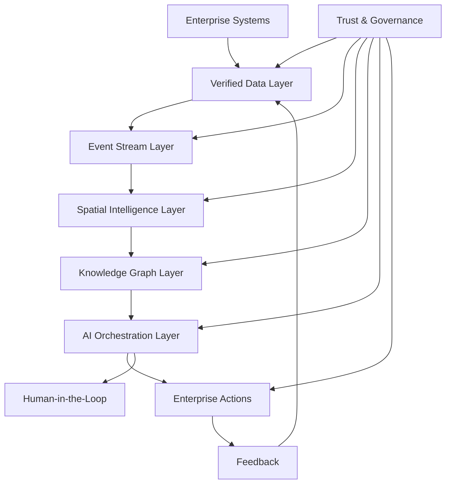

# Agentic AI Reference Architecture

```mermaid
flowchart TD
    A[Enterprise Systems] --> B[Verified Data Layer]
    B --> C[Event Stream Layer]
    C --> D[Spatial Intelligence Layer]
    D --> E[Knowledge Graph Layer]
    E --> F[AI Orchestration Layer]
    F --> G[Enterprise Actions]
    F --> H[Human-in-the-Loop]
    G --> I[Feedback]
    I --> B
    J[Trust & Governance] --> B
    J --> C
    J --> D
    J --> E
    J --> F
    J --> G
```
