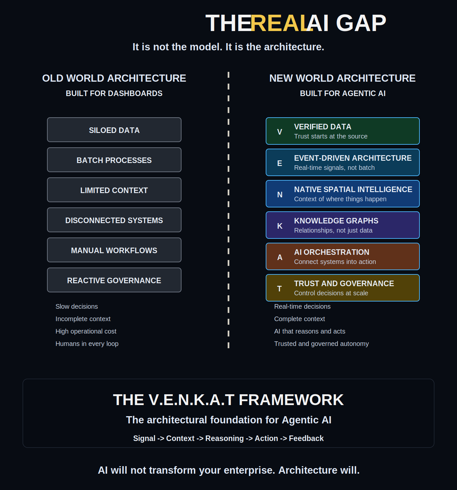
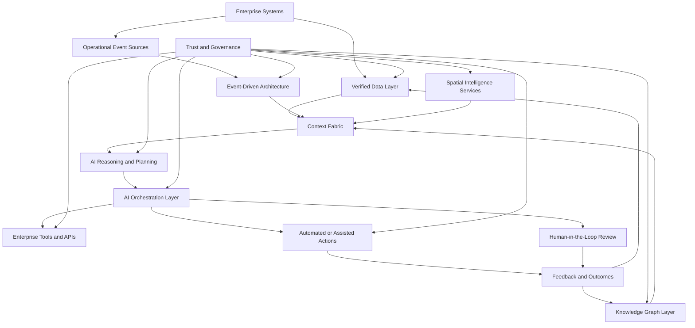

# Agentic AI Reference Architecture

This reference architecture shows how the V.E.N.K.A.T Framework organizes enterprise capabilities for trusted Agentic AI systems.

## Architecture Flow

## Core Components

| Component | Role |
| --- | --- |
| Enterprise systems | Source systems such as ERP, CRM, GIS, SCM, IoT, data platforms, and operational applications. |
| Verified Data Layer | Trusted data products, lineage, data quality, metadata, observability, and stewardship. |
| Event-Driven Architecture | Streams, topics, event mesh, change data capture, and operational triggers. |
| Spatial Intelligence Services | GIS, routing, proximity, service area, location analytics, network constraints, and digital twins. |
| Knowledge Graph Layer | Entity relationships, ontologies, policies, dependencies, and semantic context. |
| AI Reasoning and Planning | Models and agents that evaluate goals, constraints, context, options, and risks. |
| AI Orchestration Layer | Workflow execution, tool calling, API coordination, human checkpoints, and action routing. |
| Trust and Governance | Identity, access, policy, risk thresholds, approval rules, audit logs, compliance, explainability, and monitoring. |
| Feedback and Outcomes | Captured results, exceptions, overrides, user feedback, policy violations, and performance signals. |

## Design Principles

- Treat AI actions as governed enterprise operations.
- Separate reasoning from tool execution through orchestration controls.
- Make data trust and policy context machine-readable.
- Use spatial and graph context where decisions depend on relationships, routes, proximity, or dependency chains.
- Capture feedback from every action to improve trust, performance, and governance.
