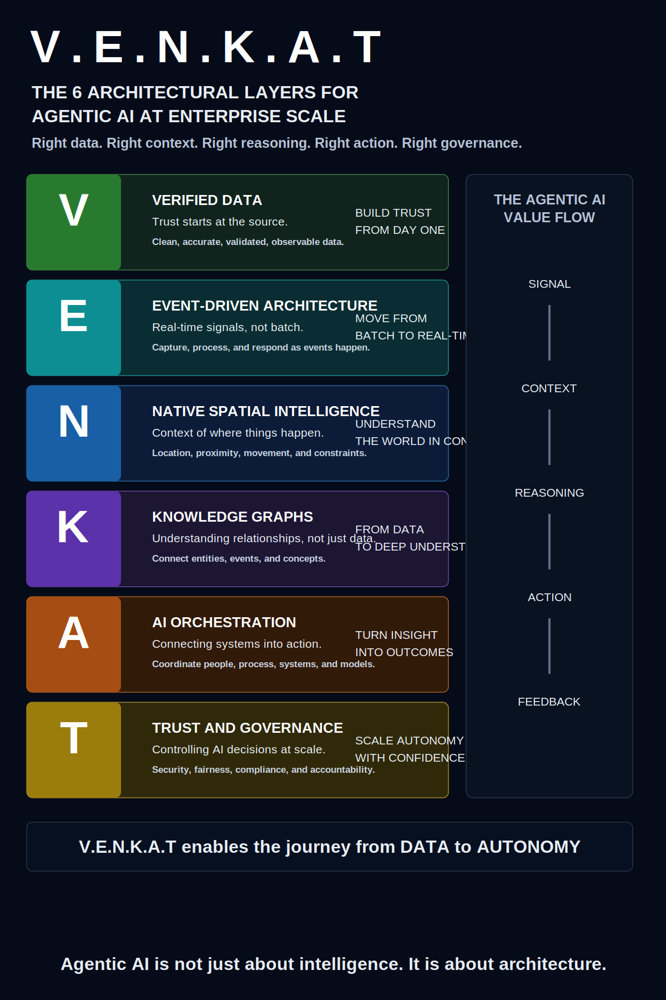

# Articles and Visuals

This page collects companion Medium articles and visual assets for the V.E.N.K.A.T Framework.

## Medium Articles

- [The V.E.N.K.A.T Framework: Building Enterprise Data Platforms for the Agentic AI Era](https://medium.com/@venkata.kondepati/the-v-e-n-k-a-t-framework-building-enterprise-data-platforms-for-the-agentic-ai-era-20352f548e40) by Venkata Kondepati, Medium.
- [The V.E.N.K.A.T Framework: Building Enterprise Architectures for the Agentic AI Era](https://medium.com/@venkata.kondepati/the-v-e-n-k-a-t-framework-building-enterprise-architectures-for-the-agentic-ai-era-d70cdf9c9b0e) by Venkata Kondepati, Medium.
- [Why Traditional Enterprise Frameworks Are Not Enough for the Agentic AI Era: Introducing the V.E.N.K.A.T Framework](https://medium.com/@venkata.kondepati/why-traditional-enterprise-frameworks-are-not-enough-for-the-agentic-ai-era-introducing-the-v-e-n-k-b5fecf48824e) by Venkata Kondepati, Medium.

## Visual Assets

## Suggested Citation

Kondepati, Venkata. "The V.E.N.K.A.T Framework: Enterprise Architecture for Agentic AI." 2026.
