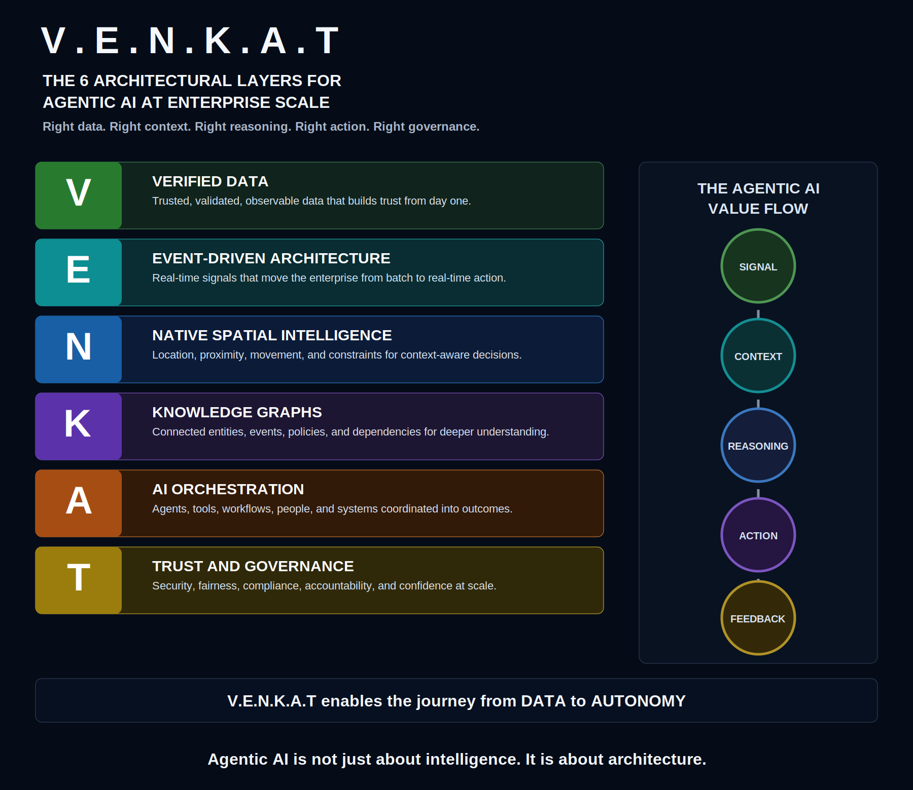

# V.E.N.K.A.T Framework Overview

The V.E.N.K.A.T Framework defines a six-layer reference architecture for enterprise Agentic AI systems. It is designed for organizations that need AI to move beyond insight generation into governed, auditable, context-aware action.

## Core Thesis

Agentic AI is an architecture problem before it is a model problem. Models can reason over prompts, but enterprises need the surrounding architecture that determines whether an AI system has trusted facts, timely signals, business context, executable tools, and policy boundaries.

## The Six Layers

### V - Verified Data

Verified Data establishes the trusted factual base for AI decisions. This includes data quality, lineage, observability, stewardship, contracts, privacy controls, and governance metadata.

### E - Event-Driven Architecture

Event-Driven Architecture brings real-time operational awareness into the framework. Events allow AI systems to respond to change as it happens instead of waiting for batch dashboards or manual escalation.

### N - Native Spatial Intelligence

Native Spatial Intelligence treats location, proximity, movement, routing, boundaries, and networks as core reasoning context. This is essential for logistics, field operations, manufacturing, utilities, smart cities, risk, and asset-heavy industries.

### K - Knowledge Graphs

Knowledge Graphs connect enterprise meaning across people, products, assets, customers, policies, locations, events, and dependencies. They help agents reason over relationships rather than isolated records.

### A - AI Orchestration

AI Orchestration coordinates agents, models, APIs, tools, workflows, enterprise systems, and human checkpoints. It turns reasoning into controlled execution.

### T - Trust & Governance

Trust & Governance provides the controls required for responsible autonomy: identity, access, policy enforcement, audit trails, approvals, explainability, risk thresholds, compliance, and rollback paths.

## Value Flow

The framework enables the operating loop required for agentic enterprise systems:

**Signal -> Context -> Reasoning -> Action -> Feedback**

1. Signals identify operational change.
2. Context enriches signals with data, location, relationships, and policies.
3. Reasoning evaluates options, risks, constraints, and objectives.
4. Action executes through governed workflows, tools, APIs, or humans.
5. Feedback captures outcomes, exceptions, overrides, and lessons learned.

## Architecture Gap

Traditional enterprise platforms were optimized for dashboards and human interpretation. Agentic systems need architectures that support trusted signals, contextual understanding, governed reasoning, orchestrated action, and continuous feedback.

## Public Resources

- Website: [https://venkatframework.com](https://venkatframework.com/)
- Whitepaper: [https://venkatframework.com/whitepaper](https://venkatframework.com/whitepaper)
- Repository: [https://github.com/vkondepati/venkat-framework-agentic-ai](https://github.com/vkondepati/venkat-framework-agentic-ai)
